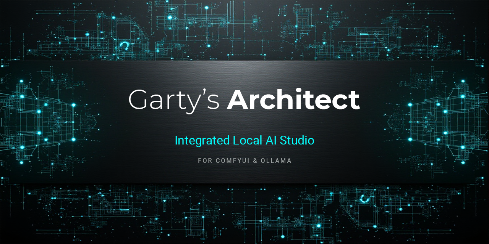

  

 

# 🏢 Garty's Architect - Integrated AI Studio

Welcome to the official repository for **Garty's Architect**, your ultimate local desktop interface for orchestrating AI models. Built to bridge the gap between the raw, limitless power of ComfyUI / Ollama and the clean, focused experience of a professional design studio.

Garty's Architect is distributed as a standalone, portable application powered by FrankenPHP. No complex web server installations, Docker containers, or environment configurations required. Just launch and create.

---

## ⚡ Core Features
* **Unified Dashboard:** Control ComfyUI and Ollama from a clean, responsive dark-mode interface. Say goodbye to spaghetti nodes and terminal windows.
* **Styles & Presets:** Save your perfect combinations of prompts, negative prompts, LoRAs, and engine settings to recreate your signature look instantly.
* **Zero-Configuration Portable Executable:** Runs locally out of a single folder using an embedded FrankenPHP binary.
* **Deterministic Asynchronous Generation:** Fire off your prompts and close the tab. The system processes everything in the background and safely stores the images with zero duplicates.
* **Lightweight SQLite Storage:** Every prompt, seed, model, and metadata is automatically saved to a local, zero-config SQLite database.
* **Multilingual UI:** Native support for English, Spanish, and Catalan.
* **100% Local & Private:** Your data, your hardware, your rules.

---

## 💻 Hardware Requirements
Since Garty's Architect communicates directly with your local AI instances, performance depends entirely on your machine.

* **Minimum Setup (SDXL / Basic Workflows):**
    * CPU: Modern quad-core processor.
    * GPU: NVIDIA GPU with 8GB VRAM.
    * RAM: 16GB system memory.
* **Recommended Setup (Flux / LTX Video Generation):**
    * CPU: Modern multi-core processor (e.g., Intel Core i7 or equivalent).
    * GPU: NVIDIA RTX series with 16GB VRAM (e.g., RTX 5060 or higher).
    * RAM: 32GB system memory.

---

## 🧠 Prerequisites: The Logic Core (Ollama)
Garty's Architect relies on local LLMs to act as the "brains" behind the scenes (prompt generation, image analysis, and UI intelligence). Ensure you have **[Ollama](https://ollama.com/)** running locally. 

For the app to work at its full potential, you must download these specific models (or register your own equivalents in the Admin Panel):
1.  **SYS_LLM (The Prompt Engineer):** `llama3.1:8b`
    * *Required to generate and amplify prompts.*
2.  **SYS_VISION (The Shadow Analyst):** `granite3.2`
    * *A lightweight vision model used internally to extract quick tags and faces for tools like ReActor and IP-Adapter.*
3.  **VISION (The Main Describer):** `qwen2.5-vl` (or Qwen 3.5 Vision)
    * *Used for deep, literary analysis of images.*

> **Quick Install:** Open your terminal and run: 
> `ollama run llama3.1:8b` | `ollama run granite3.2` | `ollama run qwen2.5-vl`

---

## 🎨 Prerequisites: The Graphic Core (ComfyUI)
Ensure you have **[ComfyUI](https://github.com/comfyanonymous/ComfyUI)** running locally. To use the advanced PRO features, your ComfyUI installation must have the following Custom Nodes installed (we highly recommend using the *ComfyUI Manager* to install them):

* **Face Swapping:** `ComfyUI-ReActor`
* **Style Transfer:** `ComfyUI_IPAdapter_plus`
* **Background Removal:** `ComfyUI-Rembg`
* **Structure Control:** `ComfyUI-Advanced-ControlNet`
* **Face Repair (ADetailer):** `ComfyUI-Impact-Pack`
* **High-Res Upscaling:** `ComfyUI_UltimateSDUpscale`
* **Image Relighting:** `ComfyUI-IC-Light`
* **Image Colorization:** `ComfyUI-DDColor`
* **Lip-Sync (Wav2Lip):** `ComfyUI-Wav2Lip`
* **Flux 2 Klein Image Editing:** `ComfyUI-Flux2KontextConditioner`
* **Qwen Image Editing:** `ComfyUI-Qwen-Image-Edit`
* **Voice Generation (OmniVoice):** `ComfyUI-OmniVoice`
* **Voice Generation (F5-TTS):** `ComfyUI-F5-TTS`
* **Voice Generation (IndexTTS-2):** `ComfyUI-IndexTTS`
* ...
---

## 🛠️ Quick Start & Installation
Getting started takes less than a minute:

1.  Download the latest Garty's Architect .zip from the Releases tab.
2.  Unzip the contents into any folder on your local machine.
3.  ⚙️ **IMPORTANT - The config.php file:** Open the `config.php` file with any text editor. You **must** set the absolute path to your ComfyUI models folder. 
    * *Example:* `define('COMFY_MODELS_PATH', 'G:\ComfyUI\models');`
    * *(Optional)* Add your Civitai API key if you want to use the integrated model downloader.
4.  Run `GartysArchitect.exe` (this will automatically initialize the local environment).
5.  Ensure you have **ComfyUI (port 8188)** and **Ollama (port 11434)** running in the background.
6.  Open your browser and navigate to `http://localhost:8000`.
7.  **(PRO Users):** Enter your License Key in the UI panel to unlock advanced features.

---

## 🚀 Editions: How to Get It

**1. The Core Experience (Free)**

Perfect for getting started. Includes the core unified dashboard, asynchronous generation, zero-config SQLite history, and multilingual support. 
👉 *Download the .zip directly from the Releases tab on the right.*

**2. PRO License**
For power users. Unlocks the true potential of the integrated studio:
* **Advanced Workflows:** Access to heavy architectures like Flux, SD3.5, Krea-2, Chroma, Z-Image, Qwen-Image, Qwen-Edit, Hunyuan Image, Hidream, LTX-Video, and Wan generation.
* **The Graphic Studio:** Unlocks Native ReActor, IP-Adapter, Rembg, High-Res Fix, and Inpainting/Outpainting.
👉 *[Unlock the PRO License here](https://garty.lemonsqueezy.com/checkout/buy/70636e1a-0dde-49c5-bf97-d4d852dceee8)*
---

## 🔮 The Roadmap
This project is an actively developed Swiss Army knife for AI enthusiasts. Coming soon:
* **Expanded Modalities:** Upcoming cutting-edge video workflows.
* **The Server Edition:** A future standalone release designed for remote network access, complete with secure multi-user logins (MySQL/MariaDB), role management, and audit logs.

---

## 🐛 Bug Reports & Feature Requests
Have an idea for a new feature? Found a bug? 
Please use the **Issues** tab at the top of this repository. Be sure to check that your ComfyUI nodes and Ollama models are correctly installed before reporting an engine failure.
